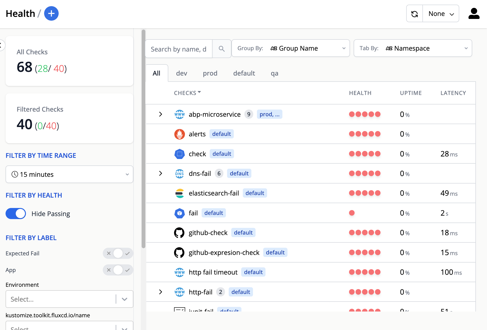

---
hide:
  - toc
---
# Health Checks

Canary Checker can collect health about systems in few different ways:

* **Active** **Application** health checks involve sending periodic requests to the service or application and checking the response to ensure that it is working correctly,  Active health checks are proactive and can detect issues quickly, but they can also introduce some load on the system being monitored.
* **Active Infrastructure** health checks are similar to application health checks, but instead of sending a request to the application it sends a request to the infrastructure to deploy a new application or infrastructure component e.g. a new Kubernetes pod or EC2 instance.
* **Passive** health checks rely on monitoring the activity in the system, analysing it, and detecting anomalies or errors. Passive health checks are less intrusive than active health checks, but they may not detect issues as quickly.

Health checks can be defined in 3 different ways:

1. **UI**: Navigate to Settings --> Health --> Click on the :material-plus-circle: button
1. **[GitOps](./concepts/gitops.md)** canary-checker is fully Gitops enabled using Kubernetes Custom Resource Definitions (CRD)
1. **[CLI](./tutorials/run.md)** For rapid development and feedback, canary-checker can be run as a normal CLI application by specifying the health check definition in a config file.

Canary checker runs health checks on a pre-defined CRON schedule and provides a fully customizable platform that:

1. Securely references [authentication](./concepts/authentication.md) credentials from Kubernetes secrets and configmaps.
1. Parses and  [transforms](./concepts/transforms.md) the response using JSONPath, Go templates or Javascript to validate, extrapolate or aggregate results.

## Check Types

| Protocol                            | Status             | Checks |
| ----------------------------------- | ------------------ | ---- |
| [HTTP(s)](../reference/http)                             | GA                 | Response body, headers and duration |
| [DNS](../reference/dns)                                 | GA                 | Response and duration |
| [Ping/ICMP](../reference/icmp)                            | GA | Duration and packet loss |
| [TCP](../reference/tcp) | GA | Port is open and connectable |
| **Data Sources**                    |                    |      |
| SQL ([MySQL](../reference/mysql), [Postgres](../reference/postgres), [SQL Server](../reference/mssql)) | GA | Ability to login, results, duration, health exposed via stored procedures |
| [LDAP](../reference/ldap)                                | GA | Ability to login, response time |
| [ElasticSearch / Opensearch](../reference/elasticsearch)           | GA | Ability to login, response time, size of search results |
| [Mongo](../reference/mongo)                               | Beta | Ability to login, results, duration, |
| [Redis](../reference/redis)                               | GA | Ability to login, results, duration, |
| [Prometheus](../reference/prometheus) | GA | Ability to login, results, duration, |
| **Alerts**                 |                    | Prometheus |
| [Prometheus Alert Manager](../reference/alert-manager) | GA | Pending and firing alerts |
| [AWS Cloudwatch Alarms](../reference/cloudwatch) | GA | Pending and firing alerts |
| **DevOps** |  |  |
| [Git](../reference/git) | GA | Query Git and Github repositories via SQL |
| [Azure Devops](../reference) |  |  |
| **Integration Testing** |  |  |
| [JMeter](../reference/jmeter) | Beta | Runs and checks the result of a JMeter test |
| [JUnit](../reference/junit) | Beta | Run a pod that saves Junit test results |
| **File Systems / Batch** |                    |      |
| [Local Disk / NFS](../reference/folder)                      | GA         | Check folders for files that are:  too few/many, too old/new, too small/large |
| [S3](../reference/s3-bucket) | GA | Check contents of AWS S3 Buckets |
| [GCS](../reference/gcs-bucket) | GA | Check contents of Google Cloud Storage Buckets |
| [SFTP](../reference/sftp) | GA | Check contents of folders over SFTP |
| [SMB / CIFS](../smb) | GA | Check contents of folders over SMB/CIFS |
| **Config**                          |                    |      |
| [AWS Config](../reference/aws-config)                          | GA | Query AWS config using SQL |
| [AWS Config Rule](../reference/aws-config-rule)                          | GA | AWS Config Rules that are firing, Custom AWS Config queries |
| [Config DB](../reference/configdb)             | GA | Custom config queries for Mission Control Config D |
| [Kubernetes Resources](../reference/kubernetes)                | GA | Kubernetes resources that are missing or are in a non-ready state |
| **Backups**                         |                    |      |
| [GCP Databases](..refere)  | GA | Backup freshness |
| [Restic](../reference/restic)                              | Beta | Backup freshness and integrity |
| **Infrastructure** |  | |
| [EC2](../reference/ec2) | GA | Ability to launch new EC2 instances |
| [Kubernetes Ingress](../reference/pod) | GA | Ability to schedule and then route traffic via an ingress to a pod |
| [Docker/Containerd](../reference/containerd) | Deprecated | Ability to push and pull containers via docker/containerd |
| [Helm](../reference/helm) | Deprecated | Ability to push and pull helm charts |
| [S3 Protocol](../reference/s3-protocol) | GA | Ability to read/write/list objects on an S3 compatible object store |
