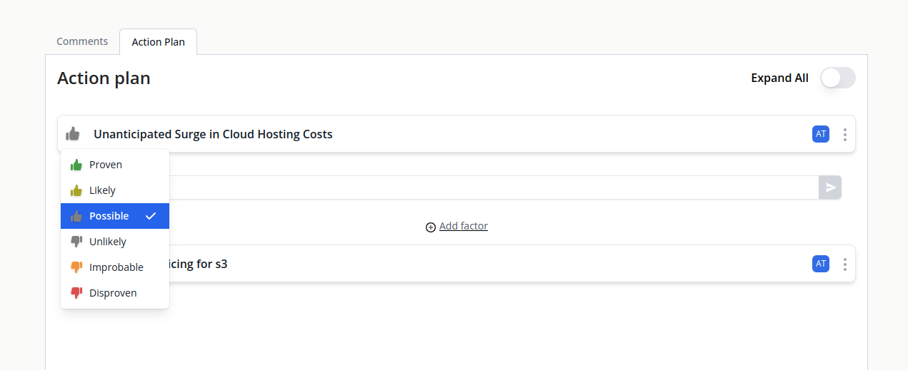
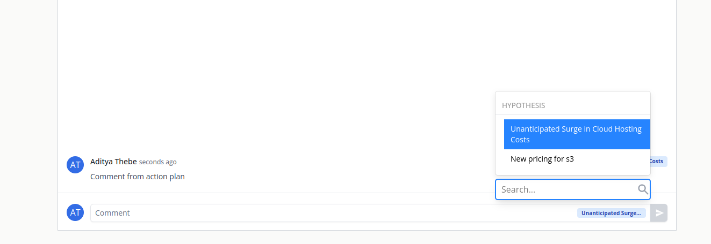

# Hypothesis

Hypotheses allow you to theorize possible causes of an incident. You can manage the evaluation of these hypotheses, and track their resolution.

## Creating a Hypothesis

When an incident occurs, it's crucial to quickly develop hypotheses about what might be causing the problem. By default, a root hypothesis is created for any new incident. To create a new hypothesis:

- Open the relevant incident.
- Go to the "Action Plan" tab.
- Click on "Add Factor" to create a new hypothesis.

## Evaluating Hypotheses

Once a hypothesis has been added, it becomes part of the incident's information. Team members can then investigate the hypothesis and update its status as needed. Any new findings about the hypothesis can be commented on the hypothesis.

### Updating Status

To update the hypothesis status:

- Open the relevant incident.
- Go to the "Action Plan" tab.
- On the relevant hypothesis and click on the icon at the beginning and select the desired status.

### Commenting

You can comment on a hypothesis either from the main incident page or from the action plan tab.

