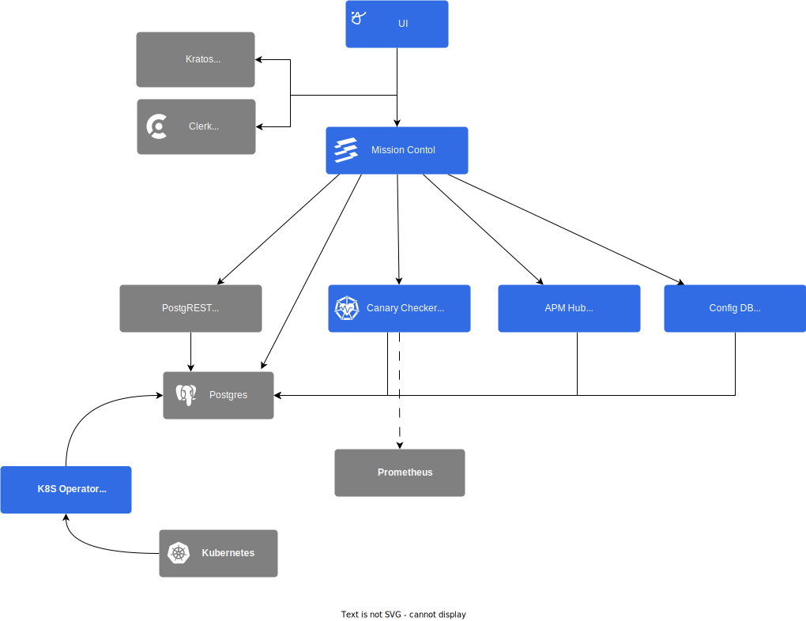

# Architecture

Mission Control has a micro-service architecture with a shared data source with multiple deployment models.

1. CLI
2. Kubernetes (Helm Chart)
3. SaaS

## Communication Model

Communication between services happen in 3 ways:

1. **Database** - A shared database with interface library enables services to query the data owned by other services by directly hitting the database using an interface provided by a shared library
2. **Messaging** - A postgres based message bus is used, database triggers insert events into queues which are then consumed by various services
3. **HTTP/REST** - This model is primarily used when the service need to interact with services outside the DB (e.g. the APM hub needs to connect to log stores to retrieve logs)

## Postgres

Postgres is the only data store used by Mission Control and is also used as a JSON document database and message queue. This limits the dependencies and complexity especially when self-hosting.

All services use a shared database and model via the [duty](https://github.com/flanksource/duty) project, this provides the following benefits:

* Limit RPC calls improving latency and performance
* Services can run with slightly different versions of the library, limiting the need for coordinated migrations
* Library updates happen automatically using dependabot

## Kubernetes & Gitops

Mission control is kubernetes-native with all configuration being possible by Custom Resource Definition (CRD's)

The single source of truth is still the database, the operators only function is to synchronize CRD's into the database and update the CRD status periodically.
