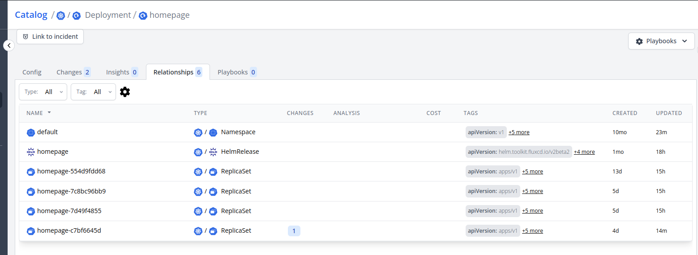

# Relationships

Relationships associate two different configs. They help in visualizing the connection of a config above and below in a hierarchy. Example: A kubernetes pod is linked to a Deployment and Replicaset and also to the persistent volumes.

## Relationship Config

This transformation function allows you to dynamically form relationships between two different config items using selectors.

Example: You can link a kubernetes deployment with the corresponding pods, or you can link AWS EC2 instances with the AWS Account. It's even possible to link two configs scraped by different scrape configs like: linking a Kubernetes Node in an EKS cluster to the EC2 instance.

| Field    | Description                                                                           | Scheme                                       | Required |
| -------- | ------------------------------------------------------------------------------------- | -------------------------------------------- | -------- |
| `filter` | Specify the config item with which relationship should be formed                      | `string`                                     | `true`   |
| `expr`   | cel-expression that returns a list of [relationship selector](#relationshipselector). | `string`                                     |          |
| `id`     | id of the config to link to                                                           | [`RelationshipLookup`](#relationship-lookup) |          |
| `name`   | name of the config to link to                                                         | [`RelationshipLookup`](#relationship-lookup) |          |
| `type`   | type of the config to link to                                                         | [`RelationshipLookup`](#relationship-lookup) |          |
| `agent`  | agent of the config to link to                                                        | [`RelationshipLookup`](#relationship-lookup) |          |
| `labels` | Labels of the config to link to                                                       | [`RelationshipLookup`](#relationship-lookup) |          |

:::info
`expr` is an alternative, more flexible, way to define the selectors. Either use `expr` or the other selector fields (`id`, `name`, `type`, `agent`, `labels`) but not both.
[**See example**](../examples/kubernetes-relationship).
:::

### RelationshipSelector

| Field    | Description                     | Scheme              | Required |
| -------- | ------------------------------- | ------------------- | -------- |
| `id`     | id of the config to link to     | `string`            |          |
| `name`   | id of the config to link to     | `string`            |          |
| `type`   | id of the config to link to     | `string`            |          |
| `agent`  | id of the config to link to     | `string`            |          |
| `labels` | Labels of the config to link to | `map[string]string` |          |

### Relationship Lookup

RelationshipLookup offers different ways to specify a lookup value

| Field   | Description                        | Scheme   | Required |
| ------- | ---------------------------------- | -------- | -------- |
| `expr`  | Use an expression to get the value | `string` |          |
| `value` | Specify a static value             | `string` |          |
| `label` | Get the value from a label         | `string` |          |
