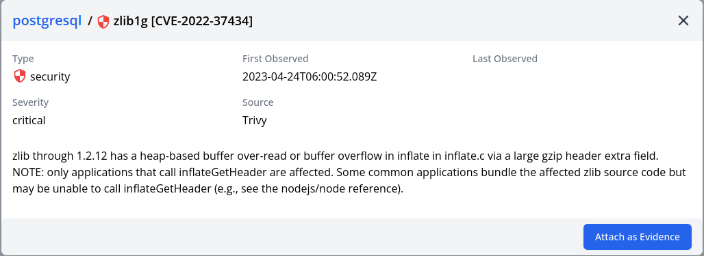

# Trivy

The `trivy` scraper uses [Trivy](https://trivy.dev/) to scan for security vulnerabilities & misconfigurations in your configuration. At the moment, there's only support for scanning Kubernetes objects.

```yaml
trivy:
  - version: "0.40.0"
    kubernetes:
      namespace: production
```

Unlike other scrapers, this one does not scape new configs but rather look for security vulnerabilities in the existing configs. This scrapper, if configured to scan a kubernetes cluster, will map all the found vulnerabilities to the corresponding config item.


_Fig: Config Insights generated by Trivy Scraper_


_Fig: A detailed view of the analysis on the postgres container_

## Scraper

| Field       | Description                                                                        | Scheme                                       | Required |
| ----------- | ---------------------------------------------------------------------------------- | -------------------------------------------- | -------- |
| `logLevel`  | Specify the level of logging.                                                      | `string`                                     | `false`  |
| `schedule`  | Specify the interval to scrape in cron format. Defaults to every 60 minutes.       | `string`                                     | `false`  |
| `full`      | Set to `true` to extract changes from scraped configurations. Defaults to `false`. | `bool`                                       | `false`  |
| `retention` | Settings for retaining changes, analysis and scraped items                         | [`Retention`](/config-db/concepts/retention) |          |
| `trivy`     | Specifies the list of Trivy configurations to scrape.                              | [`[]Trivy`](#trivy-1)                        | `false`  |

### Trivy

| Field             | Description                                                                                                                                        | Scheme                                  | Required |
| ----------------- | -------------------------------------------------------------------------------------------------------------------------------------------------- | --------------------------------------- | -------- |
| `id`              | A static value or JSONPath expression to use as the ID for the resource.                                                                           | `string`                                | `true`   |
| `name`            | A static value or JSONPath expression to use as the Name for the resource. Default value is the `id`.                                              | `string`                                | `false`  |
| `items`           | A JSONPath expression to use to extract individual items from the resource                                                                         | `string`                                | `false`  |
| `type`            | A static value or JSONPath expression to use as the type for the resource.                                                                         | `string`                                | `true`   |
| `transform`       | Specify field to transform result.                                                                                                                 | [`Transform`](../concepts/transform.md) | `false`  |
| `format`          | Format of config item, defaults to JSON, available options are JSON.                                                                               | `string`                                | `false`  |
| `timestampFormat` | TimestampFormat is a Go time format string used to parse timestamps in createFields and DeletedFields. If not specified, the default is `RFC3339`. | `string`                                | `false`  |
| `version`         | Specify the Trivy version to use. (default 0.40.0)                                                                                                 | `string`                                | `false`  |
| `compliance`      | compliance report to generate(k8s-nsa, k8s-cis, k8s-pss-baseline, k8s-pss-restricted).                                                             | `string`                                | `false`  |
| `ignoredLicenses` | specify a list of license to ignore.                                                                                                               | `[]string`                              | `false`  |
| `ignoreUnfixed`   | display only fixed vulnerabilities.                                                                                                                | `bool`                                  | `false`  |
| `licenseFull`     | eagerly look for licenses in source code headers and license files.                                                                                | `bool`                                  | `false`  |
| `severity`        | severities of security issues to be displayed (comma separated)_(default "UNKNOWN,LOW,MEDIUM,HIGH,CRITICAL")_.                                     | `string`                                | `false`  |
| `vulnType`        | comma-separated list of vulnerability types (comma separated)_(default "os,library")_.                                                             | `string`                                | `false`  |
| `kubernetes`      | Specify the trivy option to scan kubernetes objects.                                                                                               | [`K8sOptions`](#k8soptions)             | `true`   |

### K8sOptions

Trivy Options consist of selected few flags that are passed on to trivy.

| Field        | Description                                                                            | Scheme     | Required |
| ------------ | -------------------------------------------------------------------------------------- | ---------- | -------- |
| `components` | Specify which components to scan*(default workload, infra).*                           | `[]string` | `false`  |
| `kubeconfig` | Specify the kubeconfig file path to use as a static value or as a JSONPath expression. | `string`   | `false`  |
| `namespace`  | Specify a namespace to scan.                                                           | `string`   | `true`   |
| `context`    | Specify a context to scan.                                                             | `string`   | `false`  |
