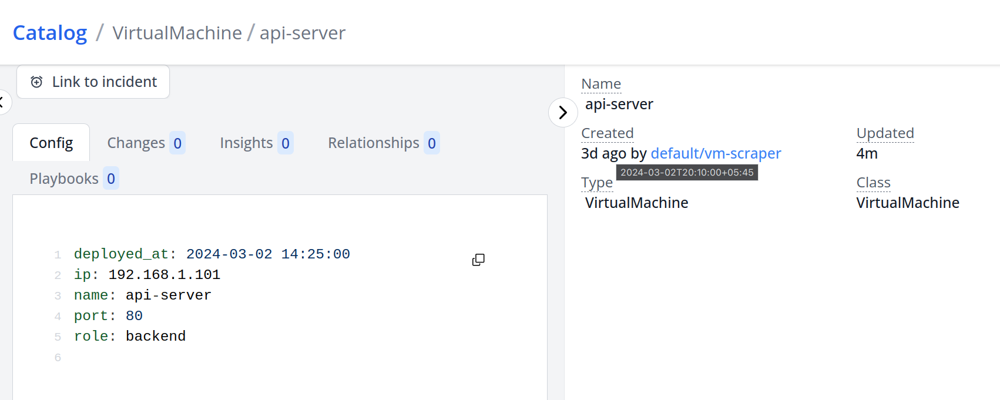

# Date Mapping

In this tutorial, you'll use the config-db CLI to scrape a file that consists of a list of virtual machines.

## 1. Create the config files

```json title="web-server.json"
{
  "name": "web-server",
  "ip": "192.168.1.100",
  "port": 80,
  "role": "frontend",
  "installed_on": "2024-03-01 12:30:00"
}
```

```json title="api-server.json"
{
  "name": "api-server",
  "ip": "192.168.1.101",
  "port": 80,
  "role": "backend",
  "deployed_at": "2024-03-02 14:25:00"
}
```

Place these two JSON files in the `/tmp/vms` directory.

## 2. Create the scrape config

Consider the following configuration file

```yaml title="vm-scraper.yaml"
apiVersion: configs.flanksource.com/v1
kind: ScrapeConfig
metadata:
  name: vm-scraper
spec:
  file:
    - type: 'Proxmox::VirtualMachine'
      class: 'VirtualMachine'
      id: $.ip
      name: $.name
      // highlight-start
      createFields:
        - $.installed_on
        - $.deployed_at
      timestampFormat: '2006-01-02 15:04:05'
      // highlight-end
      paths:
        - /tmp/vms/*
```

The `createFields` in the above scrape config instructs config-db to first look at the `installed_on` field to get the creation date of the config and then try the `deployed_at` field if it's empty. Specifying the timestampFormat is important because the timestamps in the VM configuration are not in the expected default format.


