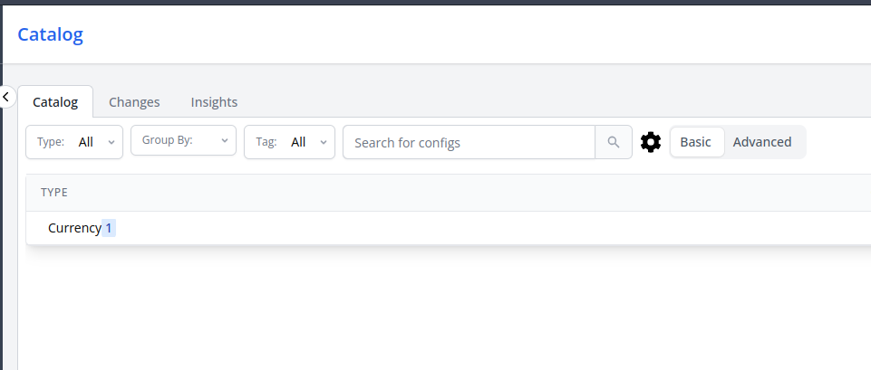
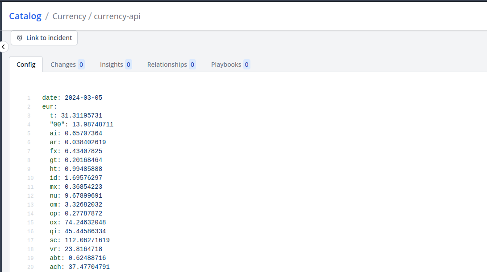
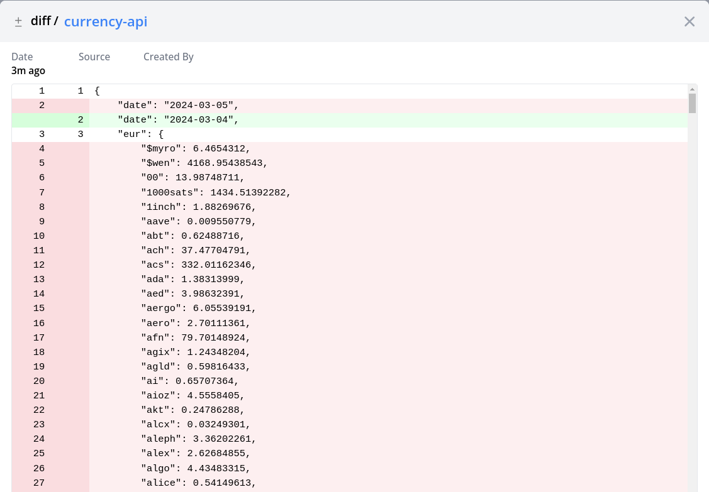

# Scraping Custom File

In this tutorial you'll scrape the currency conversion rates from a JSON file that comes from [this api](https://cdn.jsdelivr.net/npm/@fawazahmed0/currency-api@latest/v1/currencies/eur.json).

## Designing the scraper

Each config item needs two mandatory fields

- id
- type

We need to tell config-db where it can get those for our config. In this case, we'll hard-code the ids and type since
there isn't any field in the config itself that's better suited for it.

```yaml title='currency-scraper.yaml'
---
apiVersion: configs.flanksource.com/v1
kind: ScrapeConfig
metadata:
  name: currency-scraper
  namespace: default
spec:
  schedule: '@every 30s'
  file:
    // highlight-start
    - type: Currency
      id: currency-api
    // highlight-end
      name: currency-api
      url: https://cdn.jsdelivr.net/npm/@fawazahmed0/currency-api@latest/v1/currencies/eur.json
```

:::note
A config has a class associated to it. We haven't specified it here as it defaults to the `type`.
:::

The source for the file scraper can be paths to local files and also a URL to a remote file.
In this example, you'll be using the api endpoint above as the config source.

This scraper will scraper our file the api endpoint every 30 seconds and track its changes over time.

## Run the scraper

Save the scraper and wait for it to run. You should see the job status go green.


You should now be able to see the currency config type in Catalog page.



The number `1` represents that there is one config item of type `Currency`.

The content of the config items should be exactly what the api endpoint returns.



:::note
The config is represented as YAML by default however internally it is stored in its original JSON form.
:::

## Monitoring changes

Over time, as the currency exchange rate changes, you'll start to see those changes in the catalog page.
For this demonstration, we can simulate that change, by modifying the url to get the exchange rate of
the day before.

```yaml title='currency-scraper.yaml'
---
apiVersion: configs.flanksource.com/v1
kind: ScrapeConfig
metadata:
  name: currency-scraper
  namespace: default
spec:
  schedule: '@every 30s'
  file:
    - type: Currency
      id: currency-api
      name: currency-api
      // highlight-start
      # You'll need to adjust the date (2024.3.4)
      url: https://cdn.jsdelivr.net/npm/@fawazahmed0/currency-api@2024.3.4/v1/currencies/eur.json
      // highlight-end
```

You should see a new `diff` change in the config changes tab.


The summary `eur, date` indicates that the fields `eur` and `date` were modified.

To see the details of the change, click on the change row.

