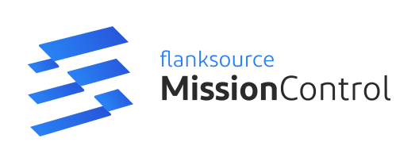

### Welcome to the Flanksource Mission Control documentation page

Flanksource Mission Control is an internal developer platform that helps teams to understand and operate complex systems easier. Mission Control includes the following features:

- A real-time map or dashboard showing the location and status of resources, including personnel, equipment and facilities.
- A messaging system for communication between the incident commander and other members of the response team.
- Tools for tracking and managing incident-related tasks, including assigning and prioritizing tasks, tracking progress and recording outcomes.
- Tools for tracking and monitoring health checks.
- Configuration tool that enables you to view and search the change history of your configuration across multiple dimensions (node, zone, environment, application, technology, etc).
- Integration with other systems such as; scrape data from network device in order to help incident commanders make informed decisions.

## Config DB

Config DB is an open source tool that allows developers to easily configure, scrape and manage data within their application. It provides a user-friendly interface for setting up and managing database connections, as well as configuring tables and fields within the database. This tool can be particularly useful for developers who need to quickly set up a database for their application, without having to manually write complex SQL queries or code. It also allows for easy updates and changes to the database as the application evolves, making it a useful tool for maintaining a healthy and efficient database.

## Health Checks

Canary checker is an open source tool that allows users to monitor the status of their canaries (server monitoring tools) in real-time. Canary checker allows users to set up alerts for when their canaries go down or encounter any issues, giving them the ability to quickly respond and fix any potential problems before they become more significant. It also provides users with detailed logs and analytics of their canary activity, giving them valuable insights into the performance and reliability of their systems. Canary checker is an essential tool for anyone who relies on canaries for server monitoring and maintenance, helping them to ensure the stability and uptime of their systems.

One potential use of Canary Checker is, if you want to get the cert expiry dates for your URLs and get warn when we are X number of days from the expiry date.

With Mission Control up and running, one can have a better understanding of their infrastructure, which helps in planning of disaster recovery and reducing downtime to the   minimum.
